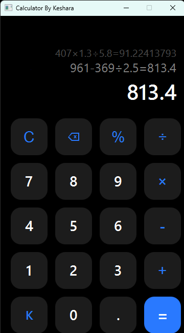

# Modern Calculator (JavaFX)

A high-precision, visually modern calculator built with JavaFX and CSS. This project replicates the premium "Dark Mode" aesthetic of modern Android calculators (Xiaomi/MIUI style) while implementing a robust mathematical evaluation engine.



## 🚀 Features

* **Professional UI:** Custom "Glassmorphism" design with a pitch-black theme and neon blue accents.
* **Advanced Logic:** Uses a custom stack-based algorithm (Dijkstra's Shunting Yard) to handle Order of Operations correctly (Multiplication/Division before Addition/Subtraction).
* **Hybrid Percentage Engine:**
    * *Unary Mode:* `100 × 30%` = `30`
    * *Binary Mode:* `2791 % 3` = `83.73` (Calculates "3% of 2791")
* **Rolling History:** Displays the last two calculations in a queue above the main result, similar to physical business calculators.
* **Vector Icons:** Uses SVG paths for the Backspace and Menu icons for crisp rendering at any scale.

## 🛠️ Built With

* **Language:** Java (JDK 17+)
* **Framework:** JavaFX
* **Styling:** CSS3 (Custom stylesheets for rounded buttons and hover effects)
* **IDE:** IntelliJ IDEA

## 📂 Project Structure

```text
src
├── main
│   ├── java
│   │   └── com
│   │       └── inventory
│   │           ├── ModernCalculator.java  # Main UI & Event Handling
│   │           ├── Evaluator.java         # Mathematical Logic Engine
│   │           └── AppLauncher.java       # Launcher fix for JavaFX modules
│   └── resources
│       └── style.css                      # UI Styling & Color Themes